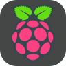
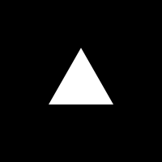
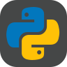
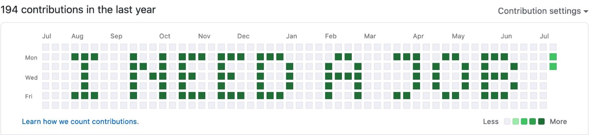

<h1>Hello World 👋 I'm CdmMandalorian</h1>

<!--

Here are some ideas to get you started:

- 🔭 I’m currently working on ...
- 🌱 I’m currently learning ...
- 👯 I’m looking to collaborate on ...
- 🤔 I’m looking for help with ...
- 💬 Ask me about ...
-->
### About Me 🚀
<h4>Software Engineer | MERN Stack Developer</h4>

<h2>Languages and Tools 🖥️📚⚒️:</h2>

     

    

    

  

 

   

### Learning 🧠

### My Experiences 🌟

University of California, Riverside 2021

### Contact 📫 

### Fun fact ⚡
<h3 align='center'>I Love Astronomy | Astrophotography and the Moon 📸🌕🪐🌌</h3>

### Now Playing 🎧

 
---

